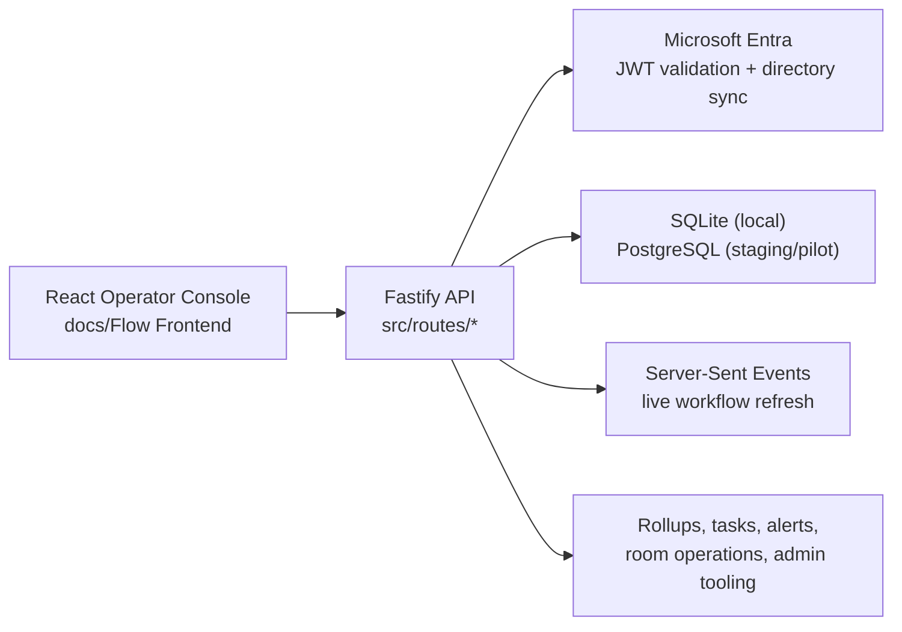

# Architecture Overview

Flow is a role-based clinical operations platform built around a single encounter lifecycle and a shared operational model for rooms, tasks, alerts, analytics, and administrative controls.

## System Overview



## Runtime Shape

- The frontend is a single operator console used by Front Desk Check-In, MAs, Clinicians, Front Desk Check-Out, Office Managers, Revenue Cycle, and Admin users.
- The backend is the system of record for workflow state, authorization, room status, operational alerts, analytics rollups, and admin configuration.
- Microsoft Entra is the identity source of truth for staged and pilot authentication.
- Flow remains the authorization source of truth through scoped role records, clinic and facility mappings, and workflow rules.

## Core Workflow Domains

### Encounter lifecycle

```text
Incoming -> Lobby -> Rooming -> ReadyForProvider -> Optimizing -> CheckOut -> Optimized
```

- Encounter progression is versioned and concurrency-safe.
- Role-scoped boards expose the same encounter from different operational viewpoints.
- Template-driven data and standard rooming fields gate movement through key stages.

### Rooms and operations

- Rooms have operational state separate from their admin lifecycle state.
- Day Start and Day End checklists affect assignability and closeout readiness.
- Room issues, holds, turnover, and analytics are modeled as first-class operational data.

### Tasks and alerts

- Tasks support encounter-linked and room-linked work.
- Alerts and thresholds provide operational escalation for safety, timing, and workflow exceptions.
- Office Manager and role-specific inboxes are fed by the same operational event model.

## Data Model Boundaries

- `User`, `UserRole`, clinic mappings, and temporary overrides determine access.
- `Encounter` is the central workflow record.
- `IncomingSchedule` is the intake/import pipeline before encounter creation or disposition.
- `ClinicRoom`, room operational state, room issues, and checklists handle room readiness.
- Daily rollups and dashboard endpoints provide operational reporting.

## Deployment Model

- Local development: SQLite plus optional developer-bypass auth
- Staging and pilot target: Azure App Service backend plus Azure Static Web Apps frontend plus Azure PostgreSQL plus Entra-backed JWT auth

## Why the repo is split this way

- [`src`](../src) keeps backend workflow and operational rules cohesive.
- [`docs/Flow Frontend`](Flow%20Frontend) contains the operator UI and frontend verification scripts.
- [`scripts`](../scripts) contains deployment, import/export, staging proof, and operational automation helpers.
- [`docs`](.) holds the runbooks, MVP tracking, and curated verification trail needed for pilot readiness.
